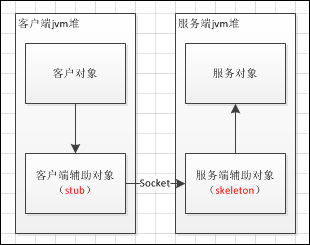
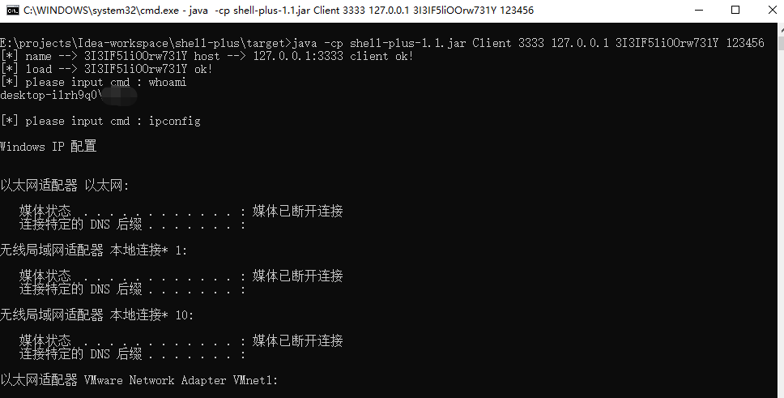

# shell-plus

Shell Plus 是基于 RMI 的一款服务器管工具，由服务端、注册中心、客户端进行组成。

### 免责声明

该工具用于服务器管理、攻防后门安全测试以及技术研究，禁止用于非法犯罪。

### 原理

RMI（Remote Method Invocation）远程方法调用。能够让在客户端Java虚拟机上的对象像调用本地对象一样调用服务端java 虚拟机中的对象上的方法。



RMI远方法程调用步骤： 
1. 客户调用客户端辅助对象stub上的方法
2. 客户端辅助对象stub打包调用信息（变量、方法名），通过网络发送给服务端辅助对象skeleton
3. 服务端辅助对象skeleton将客户端辅助对象发送来的信息解包，找出真正被调用的方法以及该方法所在对象
4. 调用真正服务对象上的真正方法，并将结果返回给服务端辅助对象skeleton
5. 服务端辅助对象将结果打包，发送给客户端辅助对象stub
6. 客户端辅助对象将返回值解包，返回给调用者
7. 客户获得返回值

举个例子：

假设A公司是某个行业的翘楚，开发了一系列行业上领先的软件。B公司想利用A公司的行业优势进行一些数据上的交换和处理。但A公司不可能把其全部软件都部署到B公司，也不能给B公司全部数据的访问权限。于是A公司在现有的软件结构体系不变的前提下开发了一些RMI方法。B公司调用A公司的RMI方法来实现对A公司数据的访问和操作，而所有数据和权限都在A公司的控制范围内，不用担心B公司窃取其数据或者商业机密。

工具借用 RMI 的调用原理，所有的数据操作都是发生在服务端进行完成的，客户端通过注册中心进行调用服务端的代码在**服务端** 进行执行，最后将相应结果进行返回。

通过编写服务器管理代码，代码进行注册到服务中，然后由客户端进行调用该服务端代码执行操作。

### 用法

开源地址：<https://github.com/0nise/shell-plus>

自行编译：

```
git clone https://github.com/0nise/shell-plus
cd shell-plus
mvn clean package -DskipTests
```

发行版本：https://github.com/0nise/shell-plus/releases

开启服务端：
```
java -cp shell-plus-1.0.jar Main <port> <ip> [pwd]
```


例子：
```
java -cp shell-plus-1.0.jar Main 3333 127.0.0.1 123456
```
连接服务端管理服务器：
```
java -cp shell-plus-1.0.jar Client <port> <ip> <name> [pwd]
```

```
java -cp shell-plus-1.0.jar Main 3333 127.0.0.1 3I3IF5liOOrw731Y 123456
```

其中 `pwd` 参数可以不填默认为空，但不推荐。

### 参考

- [Java 中 RMI、JNDI、LDAP、JRMP、JMX、JMS那些事儿（上）](https://paper.seebug.org/1091/#rmi)
- https://github.com/0nise/shell-plus
- [浅谈RMI](https://blog.csdn.net/wubinghai/article/details/82951769)